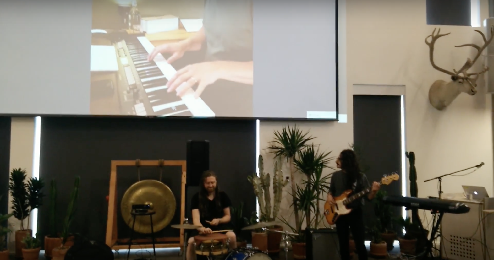

# Play Live Server



__A set of simple servers that enable realtime distributed music & audio performance application development.__

This module aims to provision servers that actualize useful patterns of musical collaboration for geographically distributed performers.

## Installation
$`npm install play-live-server`

## Use
### Import
Import **Play Live Server** into your app’s startup script (eg. `src/app.js`): <br/>
`const PlayLiveServer = require(‘play-live-server’)`

### Call With `appPath` & `type` parameters
```js
const path = require('path')

PlayLiveServer({appPath: path.join(__dirname, '/static'), type: 'p2p'})
```
* Required parameters
  * `appPath`: Provides the directory path of your app's index to the server route handler. It should be the directory where your bundle is injected into your index file (eg. static/index.html).
  * `type`: Select the server type.<br/>
  Currently supported types: `'broadcast'`, `'p2p'`

## Under Development
This module is not ready for prime-time yet, and is currently under active developement. The only reason it was published was to secure the registry name. Still, great things to come! 🙌
## 
##### License: [ISC](https://opensource.org/licenses/ISC)
